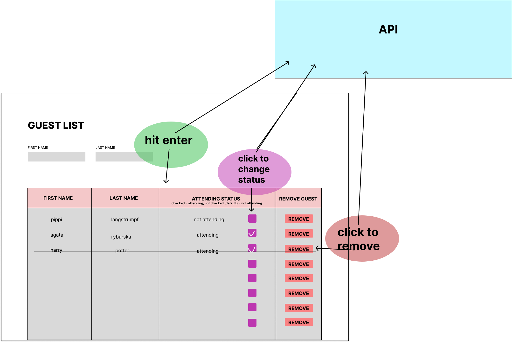

# React Guest List

This project enables the user to add and delete guests, that are entered in the input fields. Also you can change the status of the guest: not attending(default) and attending.

## Mockup

The project is planned like so:

