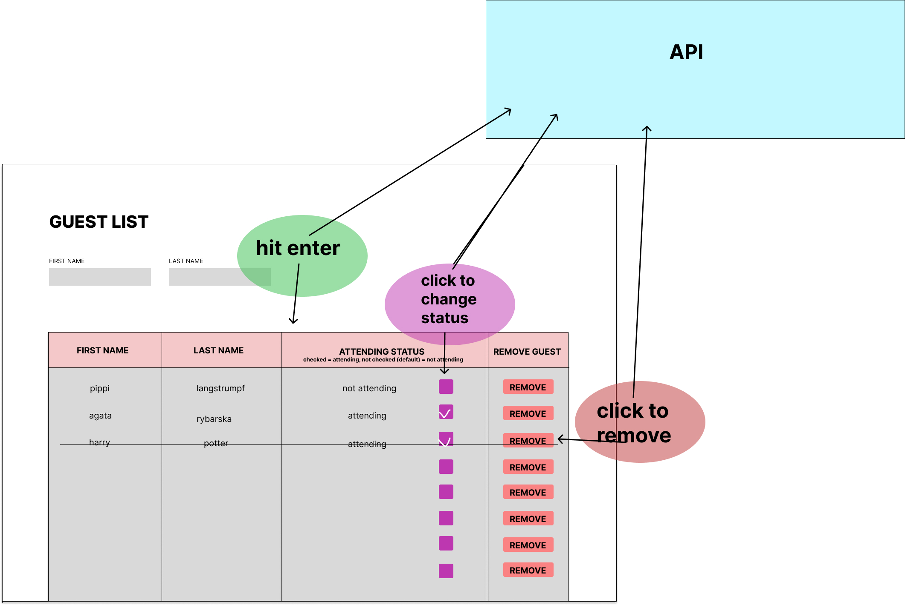

# React Guest List

This project enables the user to add and delete guests, that are entered in the input fields. Also you can change the status of the guest: not attending(default) and attending by clicking on a checkbox.

## Mockup

The project was planned and executed by following this sketch:

